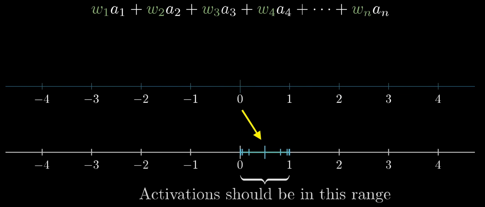

# Neural Networks
[What is a Neural Network?](https://www.youtube.com/watch?v=aircAruvnKk)
  
### Notes
  

The three different 3's are particularly different, and fire different neurons when processed. Something helps us
differentiate between things that are 3's, and something that is not.
  

  
It's easy for a human to do, but if you had to sit down and write a program, this would become extremely difficult quickly.
  
### Neurons - Units That Store Numerical Values
A neural network's input layer can be visualized as a 28 x 28 grid, where each neuron represents a pixel in an image. Each pixel (neuron) holds a grayscale value between 0 and 1, where 0 is black and 1 is white.

  
The input layer consists of 784 neurons (28 x 28 = 784). The output layer contains 10 neurons, each representing the network's confidence that the input image represents that particular digit (0-9).

  
Hidden layers are the intermediate layers between input and output. Their size is a hyperparameter that can be adjusted based on the problem (in this example, 16 neurons were chosen).

  
Information flows through the network as neurons activate other neurons in subsequent layers. The final output layer's most strongly activated neuron indicates the network's prediction.
  
While humans recognize digits by identifying specific features (like loops in 8's and 9's, or curves in 3's), neural networks learn to detect patterns in a more abstract way.
  

  

  
The layers are connected together detecting edges and patterns to form a coherent result. We have control over "knobs",
called "parameters" that allow us to find the right combination over values in the neural network. They're like knobs we
can turn to focus in on the right patterns. We'll assign a "weight" to each one of the connections between our layer and
the first layer.
  
The connections between layers are defined by weights and biases. Weights determine how strongly each neuron's activation affects neurons in the next layer, while biases adjust the threshold at which neurons activate.
  

For each neuron in a layer, we compute a weighted sum of all inputs from the previous layer:

  
This weighted sum can result in any number, but we want to normalize the neuron's output:

To achieve this normalization, we use an activation function (like the sigmoid function) to "squash" the values into a desired range (typically 0 to 1). The sigmoid function transforms negative inputs to values close to 0 and positive inputs to values close to 1.
  

The alorithm to squash these numbers to the center is called the Sigmoid function. Negative values end up closest to 0, 
very positive values end up closest to 1.

  
Say we didn't want to choose 0-1, we might want it to be when the sum is closest to 10. We could just add -10 to the weights
before running it through the Sigmoid function. That number is called the "bias". The weights tell you what pixel pattern
the neural network is picking up on. The bias means how high we want the weights to be before neurons start getting
activated.
  

  
Each layer would have some weights and biases.

  
Learning - finding the right weights and biases. This would impossible for a human to do by hand, so we need some way for the weights and biases to be adjusted automatically. For a good idea ofwhat matrix multiplication means, review [3b1b linear algebra](https://www.youtube.com/watch?v=fNk_zzaMoSs)
  
